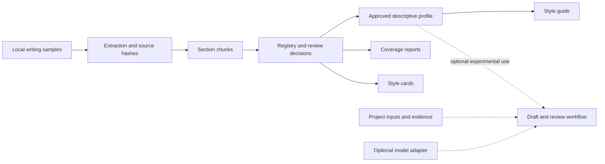

# ManuscriptForge

A Python research prototype for inspecting writing corpora, curating section-level examples, and producing traceable descriptive style profiles.

**Experimental research prototype.** ManuscriptForge makes the decisions between a source document and a style summary inspectable: which passages were extracted, which were approved or excluded, and which contributed to each section profile. It also contains experimental manuscript, evidence-audit, and review workflows that require human assessment.

The offline demo runs the actual extraction, curation, and profiling code on three original synthetic documents. It needs no API key, GPU, model download, or private files.

## Quickstart

Use Python 3.11, 3.12, or 3.13 and Git. Installation downloads the declared Python dependencies; the demo itself runs offline.

```text
git clone https://github.com/ericrosenn1/manuscriptforge.git
cd manuscriptforge
```

Windows PowerShell:

```powershell
py -3.12 -m venv .venv
.\.venv\Scripts\python.exe -m pip install .
.\.venv\Scripts\manuscriptforge.exe demo ..\manuscriptforge-demo
```

Linux or macOS shell:

```bash
python3 -m venv .venv
source .venv/bin/activate
python -m pip install .
manuscriptforge demo ../manuscriptforge-demo
```

Open `../manuscriptforge-demo/DEMO_REPORT.md`, then follow its links to the style guide, chunk review, and coverage report. Run the same demo command again to verify the saved outputs without changing them. The destination must be new, empty, or an unchanged completed demo.

The validated [summary excerpt](examples/demo_expected_summary.json) includes:

```json
{
  "validation_status": "PASS",
  "source_documents": 3,
  "input_formats": [".docx", ".md", ".txt"],
  "extracted_chunks": 7,
  "approved_chunks": 6,
  "excluded_duplicate_chunks": 1,
  "profile_word_count": 432,
  "profile_sentence_count": 26,
  "style_cards": 8
}
```

The fictional distance-workflow collection contains six sections and an exact methods duplicate. Scripted review explicitly excludes the duplicate; matching hashes alone do not remove it. Each retained section has one passage, so its coverage is **sparse**. These counts demonstrate the workflow, not writing quality, instrument performance, or learned author preferences. See the [demo walkthrough](docs/demo.md) for the content checks and expected limitations.

## Available scope

| Capability | Status and boundary |
| --- | --- |
| Markdown, text, DOCX, and PDF extraction | Local extraction with cached text, source hashes, and status records. PDF requires a text layer; OCR is not implemented. |
| Section detection and chunking | Rules recognize common headings and split long passages. References are excluded by default. |
| Chunk curation | Review tables, warning flags, explicit approvals/exclusions, and a decision log. Strict approval is enabled in the demo; general project defaults are permissive. |
| Descriptive profiles and style cards | Global and section counts, length distributions, terms, punctuation, and traceable text examples. Linguistic indicators use heuristics. |
| Evidence and manuscript workflows | Experimental claim registries, citation mapping, audits, deterministic draft/review paths, and Markdown/DOCX/LaTeX/XLSX exports. Passing software checks does not establish scientific validity. |
| Model-assisted drafting | Optional provider adapter. The demo and ordinary tests do not establish live-model performance. |

There is no trained personalized writer or validated style-quality metric in this release. Possible future work includes stronger format interpretation and evaluation with independently reviewed corpora; no release or maintenance schedule is promised.

## Data flow



The solid path is exercised by the demo with strict approval. The dashed branch represents separately invoked experimental functionality. [Architecture](docs/architecture.md) maps these steps to the public modules.

## Inputs, outputs, and privacy

Projects have a `project.yaml`, an `inputs/` directory, and a `style_corpus/` directory. Style samples can be organized under modes such as `style_corpus/academic_manuscript/`. Extraction and curation derivatives live under `planning/intake/`; profiles and workflow results live under `outputs/`. The demo creates its entire project in the selected destination, outside the checkout in the quickstart above.

Source documents remain separate from extracted text and reviewed derivatives. Chunk IDs, content hashes, source filenames, and decision notes link profile examples to their inputs. Curation decisions are local records and are not proof of independent human review; the demo labels its decisions as scripted.

Import, help, and demo commands do not discover writing outside the selected project or start automation. Local artifacts can contain absolute source paths and source prose, including in profiles and style cards. They are not automatically anonymized. Review outputs before sharing them. Explicitly configuring a network-capable provider or metadata enrichment is a separate action; the demo sets local-only operation and never calls a provider.

See [working with your own project](docs/usage.md) for configuration and review commands.

## Development

```text
python -m pip install -e ".[dev]"
python -m pytest
python -m ruff check .
python -m mypy manuscriptforge
python -m build
```

Use the virtual environment's Python, or its full path on Windows. Tests use synthetic temporary projects and offline provider fixtures. The [development notes](docs/development.md) describe package validation and the limits of these checks.

## Author and license

Created by Eric H. Rosenn. This research prototype was developed with AI coding assistance; human review remains necessary for its code, outputs, and scientific use.

**License not yet specified.** No project-wide reuse license is granted here. Dependency licenses and any applicable third-party notices remain with their respective materials.
