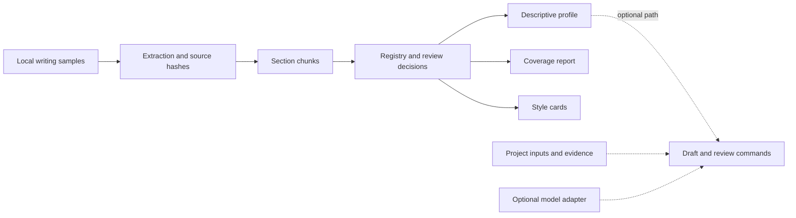

# ManuscriptForge

ManuscriptForge organizes an author's writing samples into reviewed passages and section-specific style summaries. Its Python tools extract text from local documents, record which passages are included or excluded, and generate reports that link summaries back to their source material.

The workflow helps researchers assemble an inspectable collection of examples for consistent manuscript preparation, rather than mixing whole documents and unreviewed passages. It can also provide a transparent starting point for future personalized writing workflows. It does not train a model or automatically reproduce an author's prose.

**Experimental research software.** The implemented core workflow is local extraction, passage curation, descriptive profiling, and traceable reporting. Optional manuscript, evidence, and review commands need human assessment.

## Quick start

Use Python 3.11, 3.12, or 3.13 and Git. The Windows example selects Python 3.12; the package supports all three versions. Installation downloads the declared Python dependencies, while the demo itself runs offline.

```text
git clone https://github.com/ericrosenn1/manuscriptforge.git
cd manuscriptforge
```

Windows PowerShell:

```powershell
py -3.12 -m venv .venv
.\.venv\Scripts\python.exe -m pip install .
.\.venv\Scripts\manuscriptforge.exe demo ..\manuscriptforge-demo
```

Linux or macOS shell:

```bash
python3 -m venv .venv
source .venv/bin/activate
python -m pip install .
manuscriptforge demo ../manuscriptforge-demo
```

Open the generated DEMO_REPORT.md, then follow its links to the style guide, passage review, and coverage report. Running the same command again verifies the completed demo without changing it. The destination must be new, empty, or an unchanged completed demo.

## What the offline demo produces

The demo uses three original synthetic documents about an invented distance-sensor documentation procedure: a Markdown protocol, a text run note, and a DOCX copy of the methods section. It extracts seven **chunks**, meaning section-labeled passages, and scripted review retains six while explicitly excluding the exact DOCX duplicate. A matching hash creates a warning; it does not automatically remove text.

The validated result contains:

- 3 source documents in Markdown, text, and DOCX
- 7 extracted chunks, with 6 approved and 1 excluded duplicate
- a 432-word descriptive profile across 6 sections
- 8 **style cards**, which are short section reports with passage counts, length statistics, common signals, and source-linked examples

These counts demonstrate the workflow on synthetic content. The [demo walkthrough](docs/demo.md) explains the collection, checks, and expected outputs.

## Core workflow



1. Add local documents to a project and extract supported Markdown, text, DOCX, or text-based PDF files.
2. Inspect the extracted chunks, their source hashes, section labels, warnings, and review state.
3. Record approvals or exclusions in the chunk registry. Strict approval can be enabled before profiling.
4. Build a descriptive profile and section-level style cards from the selected chunks.
5. Use the profile, coverage report, and source links to review what entered each summary.

The solid path is exercised by the offline demo. [Architecture](docs/architecture.md) maps the workflow to public modules.

## What is implemented

| Capability | Current behavior |
| --- | --- |
| Local document extraction | Extracts Markdown, text, DOCX, and text-based PDF files; stores source hashes, cached text, and extraction status. PDF OCR is not included. |
| Chunking and curation | Recognizes common section headings, splits passages, records warnings, and preserves explicit approvals, exclusions, notes, and intended uses. |
| Descriptive profiling | Calculates global and section-level counts, length distributions, terms, punctuation, and source-linked examples. Linguistic indicators are rule-based. |
| Coverage and style cards | Shows where reviewed passages exist, flags sparse sections, and writes compact section reports. Passage-count indicators are not quality or validity measures. |
| Optional manuscript and review commands | Provides claim registries, citations, audits, deterministic draft and review paths, and Markdown, DOCX, LaTeX, and XLSX exports when explicitly invoked. |
| Optional provider adapter | Requires explicit configuration. The demo does not call a provider and does not need an API key, download a model, or require a GPU. |

## Working with your own project

Create a separate project directory for local data and derivatives:

Activate the virtual environment before using the commands below. On Windows, use `.\.venv\Scripts\Activate.ps1`, or replace `manuscriptforge` with `.\.venv\Scripts\manuscriptforge.exe`.

```text
manuscriptforge init ../writing-project
```

Replace the starter text in inputs/abstract.md and inputs/methods.md, then add the writing samples you intend to analyze under style_corpus/academic_manuscript/. When those files are ready:

```text
manuscriptforge validate ../writing-project
manuscriptforge extract-style-corpus ../writing-project --mode academic_manuscript
manuscriptforge build-style-chunk-registry ../writing-project --mode academic_manuscript
manuscriptforge style-chunk-report ../writing-project
```

Review the registry under planning/intake/style_chunks before approval. With strict approval enabled in project.yaml, a profile only uses chunks approved for the style_profile use:

```text
manuscriptforge style-chunk-approve ../writing-project --source-file style_corpus/academic_manuscript/sample.md --approve --approve-for style_profile --note "Reviewed for descriptive profiling."
manuscriptforge profile-style ../writing-project
manuscriptforge style-coverage-report ../writing-project --mode academic_manuscript
manuscriptforge build-style-cards ../writing-project --mode academic_manuscript
```

See [working with your own project](docs/usage.md) for configuration, intended-use approvals, and detailed review commands.

## Data handling

The core corpus workflow reads documents from the selected project, and the demo does not search other locations. Profiles, cards, extraction records, and review tables can contain source prose and local paths. Review generated artifacts before sharing them. Network-capable providers and metadata enrichment require separate, explicit configuration; the demo uses local-only settings and no provider.

## Development and supporting documentation

The [demo walkthrough](docs/demo.md) describes the synthetic example. [Architecture](docs/architecture.md) explains artifact boundaries, and [development notes](docs/development.md) list the test, lint, type-check, build, and package-install checks.

```text
python -m pip install -e ".[dev]"
python -m pytest
python -m ruff check .
python -m mypy manuscriptforge
python -m build
```

## Author and license

Created by Eric H. Rosenn. This research software was developed with AI coding assistance; human review remains necessary for code, outputs, and scientific use.

**License not yet specified.** No project-wide reuse license is granted here. Dependency licenses and applicable third-party notices remain with their respective materials.
