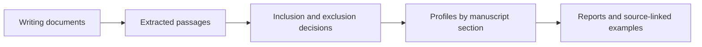

# ManuscriptForge

ManuscriptForge turns local writing documents into reviewed passages, descriptive style profiles, and reports linked to their sources.

A writing **corpus** is a collection of writing samples. Researchers can use ManuscriptForge to inspect that collection, decide which passages belong in it, and compare descriptive statistics and examples across manuscript sections. The recorded decisions and source links make it possible to see exactly which text contributed to a summary.

[](https://github.com/ericrosenn1/manuscriptforge/actions/workflows/ci.yml?query=branch%3Amain)

## Quick start

Use Python 3.11, 3.12, or 3.13 and Git. The Windows example selects Python 3.12; the package supports all three versions. Installation downloads the declared Python dependencies, while the demo itself runs offline.

```text
git clone https://github.com/ericrosenn1/manuscriptforge.git
cd manuscriptforge
```

Windows PowerShell:

```powershell
py -3.12 -m venv .venv
.\.venv\Scripts\python.exe -m pip install .
.\.venv\Scripts\manuscriptforge.exe demo ..\manuscriptforge-demo
```

Linux or macOS shell:

```bash
python3 -m venv .venv
source .venv/bin/activate
python -m pip install .
manuscriptforge demo ../manuscriptforge-demo
```

Open the generated `DEMO_REPORT.md` first. It links to the style guide, passage review, coverage report, and a style card. Running the same command again verifies the completed demo without changing it. The destination must be new, empty, or an unchanged completed demo.

## What the offline demo produces

The demo uses three synthetic documents about an invented distance-sensor documentation procedure. It extracts **chunks**, meaning section-labeled passages, then applies scripted inclusion and exclusion decisions. The DOCX repeats the Markdown methods text: matching hashes flag both copies, and an explicit decision excludes the duplicate.

| Output | Demonstrated result |
| --- | --- |
| Extraction | 3 documents in Markdown, text, and DOCX; 7 chunks |
| Passage review | 6 approved chunks and 1 excluded duplicate |
| Style profile | Descriptive statistics and examples from 432 words across 6 sections |
| Style cards | 8 compact reports for individual sections and the overall collection |

The demo needs no model provider, API key, or GPU. The [walkthrough](docs/demo.md) explains the input collection, checks, and reports.

## Core workflow



**Curation** means deciding which passages are included or excluded. The demo requires explicit approval before profiling; for your own project, enable strict approval as shown in the [usage guide](docs/usage.md). [Architecture](docs/architecture.md) maps this workflow to the implementation.

## What is implemented

| Capability | Current behavior |
| --- | --- |
| Local document extraction | Extracts Markdown, text, DOCX, and text-based PDF files; stores source hashes, cached text, and extraction status. PDF OCR is not included. |
| Chunking and curation | Recognizes common section headings, splits passages, and preserves approvals, exclusions, review notes, and which uses each passage is approved for. |
| Descriptive profiling | Calculates global and section-level counts, length distributions, terms, punctuation, and source-linked examples. Linguistic indicators are rule-based. |
| Coverage and style cards | Shows passage counts by section, flags sparse sections, and writes section reports with examples. Coverage labels describe counts, not writing quality; [the walkthrough](docs/demo.md#reading-the-outputs) defines the thresholds. |

### Experimental and optional components

Additional commands support claim and citation records, drafting, audits, feedback, and Markdown, DOCX, LaTeX, and XLSX exports. A model-provider adapter and local interface are optional integrations. See the [experimental manuscript path](docs/architecture.md#experimental-manuscript-path) for their scope.

## Using your own corpus

Create a separate project directory and add the writing samples you want to analyze. The [usage guide](docs/usage.md) walks through configuration, extraction, passage review, approval for specific uses, and report generation.

## Data handling

The core corpus workflow reads documents from the selected project. Profiles, cards, extraction records, and review tables can contain source prose and local paths, so inspect generated artifacts before sharing them. Network-capable providers and metadata enrichment require separate, explicit configuration.

## Development and supporting documentation

| Guide | Contents |
| --- | --- |
| [Demo walkthrough](docs/demo.md) | Synthetic inputs, review decisions, reports, and unchanged-rerun checks |
| [Usage](docs/usage.md) | Configure and analyze your own writing collection |
| [Architecture](docs/architecture.md) | Modules, artifact structure, and optional components |
| [Development](docs/development.md) | Tests, lint, typing, builds, and installed-package checks |

## Project status, author, and citation

Version 0.1.0 is an initial research prototype centered on the offline corpus workflow. It provides a foundation for exploring personalized writing workflows, but does not train a personal model or validate imitation of an author's style.

Created by Eric H. Rosenn with AI coding assistance. Citation metadata is available in [CITATION.cff](CITATION.cff).

**License not yet specified.** No project-wide reuse license is granted here. Dependency licenses and applicable third-party notices remain with their respective materials.
